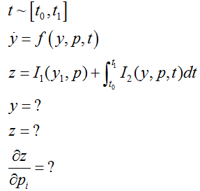

# odeAdjoint
odeAdjoint is a lightweight solver for 1st order explicit ODE system implemented in python. Given the required input from user, the integrator is able to provide the value of states (y) at the integration end time (t1), the variables of interest (z) and their derivative(dz/dp) w.r.t input parameters (p).

## Prerequisite
No other C++ or Fortran libraries are needed, making it easy to use on all platforms. The only prerequisites are:
* Python3
* Numpy
* Scipy

##  Coment
odeAdjoint is not designed to be as efficient as possible; simplicity and flexibility is what it intends for. Hence, it is only good for algorithm prototyping; for more accurate and efficient integrator, user is referred to other well-known package in Fortran or C++ such as [SUNDIALS](https://computing.llnl.gov/projects/sundials).

## Problem Formulation


## Usage
You'll need to derive from the solver base class:
```python
class Example(Ode1stExplicit):
```
The base class is an abstract base class (ABC) in python so you'll need to override all abstract methods. For example, method 'f' defines the right hand side of your equation and you should define it in the derived class:
```python
    def f(self, t, y):
        rhs = np.zeros(2)
        rhs[1] = y[0]
        return rhs
```
See /example and /test for more details.
